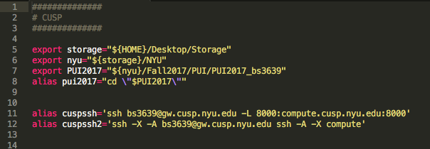
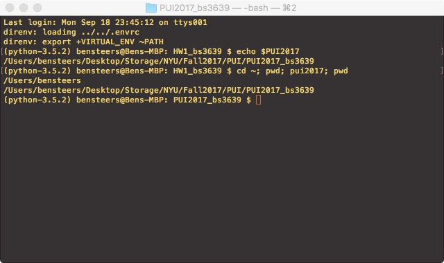

 # Homework 1

## Assignment 1: Lab 1
Here are the relevant links for Lab 1.

[my Github](https://github.com/bensteers/)

[my gittest repo](https://github.com/bensteers/gittest_bs3639)

[neighbor’s gittest repo](https://github.com/yixuantang/yixuantang/)

[my fork](https://github.com/bensteers/yixuantang/)

## Assignment 2: Setup environment
This is a screenshot of my .bash_profile showing the requested alias/export declarations.

This is the bash output for the alias/export test commands.

## Assignment 3: Reproducible research

The Jupyter notebook can be found here: [Assignment 3](./HW1_3.ipynb)