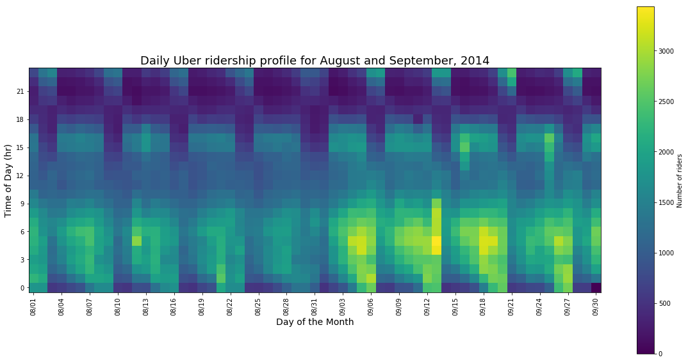

# Homework 8

**Figure 1.** Daily Uber ridership profile for the month of April, 2014. There is a recurring peak at around 6am, presumably for the morning commute, and another around 5pm, just in time for the evening commute. There is also weekly periodicity, where the morning and evening commute patterns exist during the week, but stop for two day periods. Additionally, weekends see their peaks leading up to midnight implying that more people are out at most likely intoxicated so they need a ride home. None of this is at all unexpected behavior.